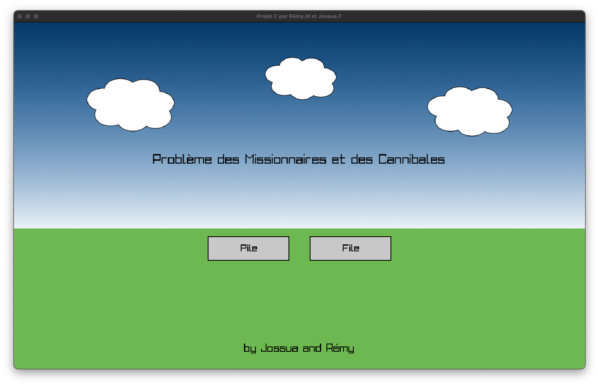

## Table des matières
- [Introduction](#introduction)
- [Installation](#installation)
- [Compilation et exécution](#compilation-et-exécution)
- [Démonstration](#démonstration)
- [Crédits et licence](#crédits-et-licence)

### démo en ligne
- [Accès à la démo en ligne (redirection)](https://remyweb.fr/missionnaires-cannibales/)


## Introduction

Le problème des missionnaires et des cannibales est un célèbre puzzle de logique et de traverse. Les règles sont simples :

- 3 missionnaires (  ) et 3 cannibales (  ) doivent traverser une rivière
- Ils disposent d'un bateau  qui peut contenir au maximum 2 personnes
- Si à un moment donné sur une rive, les cannibales sont plus nombreux que les missionnaires, les cannibales mangent les missionnaires
- Le bateau doit toujours être conduit par au moins une personne
- L'objectif est de faire traverser tout le monde sans perdre de missionnaires

Ce projet implémente deux versions de résolution du problème:
- Une version utilisant une **pile** (LIFO - Last In, First Out)
- Une version utilisant une **file** (FIFO - First In, First Out)


## Installation

#### Prérequis

Pour compiler et exécuter ce projet, vous aurez besoin de :
- Un compilateur C (gcc, clang)
- La bibliothèque raylib

### Installation de raylib

#### MacOS (Intel/Apple Silicon)
Prérequis : avoir Homebrew installé
```bash
# Installation de raylib
brew install raylib

# Optionnel : Installer pkg-config pour simplifier la compilation
brew install pkg-config
```

#### Linux
Prérequis :
```bash
sudo apt install build-essential git libasound2-dev libx11-dev libxrandr-dev libxi-dev \
     libgl1-mesa-dev libglu1-mesa-dev libxcursor-dev libxinerama-dev libwayland-dev \
     libxkbcommon-dev
```

Installation :
```bash
wget https://github.com/raysan5/raylib/archive/refs/tags/5.0.tar.gz
tar -xzf 5.0.tar.gz
cd raylib-5.0/src/
make PLATFORM=PLATFORM_DESKTOP
sudo make install
```

#### Windows (10/11)
Installation avec MSYS2/MinGW64 :
```bash
# Installer MSYS2 depuis https://www.msys2.org/
# Ouvrir le terminal MSYS2 MinGW 64-bit et exécuter :
pacman -S mingw-w64-x86_64-raylib

# Ou utiliser la ligne de compilation suivante avec les bibliothèques préinstallées :
# C:/msys64/mingw64/bin/gcc.exe -fdiagnostics-color=always -g main.c file.c pile.c file.h pile.h common.c common.h -o main.exe -I C:/msys64/mingw64/include -L C:/msys64/mingw64/lib -lraylib -lopengl32 -lgdi32 -lwinmm -fcommon
```

## Compilation et exécution

### MacOS
```bash
cc main.c pile.c file.c common.c -o main $(pkg-config --libs --cflags raylib)
./main
```

### Linux
```bash
gcc main.c pile.c file.c common.c -o main -lraylib -lGL -lm -lpthread -ldl -lrt -lX11
./main
```

### Windows
```bash
gcc main.c pile.c file.c common.c -o main.exe -lraylib -lopengl32 -lgdi32 -lwinmm
main.exe
```

## Démonstration

### Accueil 


### Exécution Pile


### Exécution File 


## Crédits et licence

Les assets du projet ont été créés sur Figma, librement inspirés du jeu [Cannibals & Missionaries](https://plastelina.net/cannibals-missionaries/) développé par Shlomir Hadad en 2001.

Ce projet est sous licence MIT.
